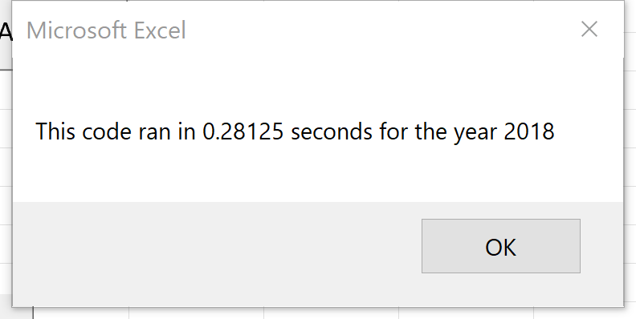

# Stock Analysis
## Overview of the Project
Stocks Analysis project uses Steve's Green-Stocks dataset to help his parents to analyze their investments. By analyzing *12* different Stocks in *2017* and *2018*, we have already prepared a workbook to give more insight of some Stocks. However,in order to expand all data of entire stocks' Market over the last few years, we try to improve our programming code by refactoring existing coding. The goal of this project is to seeking higher efficient programming codes to run through all Stocks data. 
## Results
We use VBA to refactor our coding, loop through all the dataset several times. We found that the refactored script works more efficient. While original script has more than one second runtime in both years, the refactored script runs only for *0.29* or *0.28* seconds. The performance of refactored codes is **4times** faster than our original script. After we refactoring the codes, it improved about ***70%*** efficiency of the execution times. The execution times of the original script and the refactor script of stocks for both year *2017* and *2018* show as below:

 

 

## Summary
### Pros and Cons refactoring code
In the coding process, the advantage of refactored code is more efficient. When we create small change from our original script, it helps us to improve the execution times. For example, refactored code runs **4times** faster than the original script. We create *4* different arrays to establish the nested loop, make it clear and easier to read. In particular, it benefits future users to use this script when applying to entire stock market over years. However, it is challenging when the refactored code is working but endup with different results. And we spend many attempts to check through each details to solve this issue. The disadvantage of refeactoring code could be attempting many times to test refactored code and make sure its result as same as original script. You may need to consider time consuming if we have larger or broad test cases.
### Advantages and Disadvantages of the Original and refactored VBA script
As we review the original VBA script, we have a good patterns to follow general instructions. Also, each step of the original script has notation that benefits reader to undserstand our programming design. However，the disadvantage of the original script takes longer time to run through the whole process.Comparing our result, it takes more than one second to finish our analysis for each year. If we have larger dataset to run the script, it will spend too much time to get the result. On the contrary, the refactoring code can optimize our program, reducing computing cost, and help us to improve efficency. Although refactored script benefits us shorten amount of time, you might have to pay extra attention to change the blocks and debugging that make sure get the same result as original script. 

### Resources
Insights: https://docs.google.com/presentation/d/10JsBXgpTH3SRuo703oLNw_D6z1JsYenATXSgkK6pw7g/edit?usp=sharing
